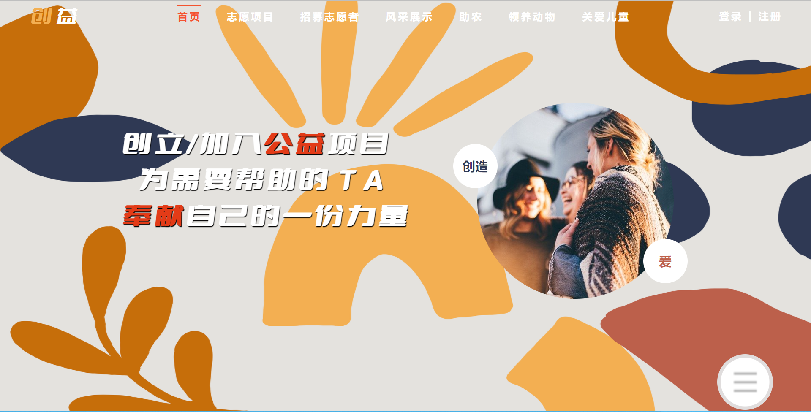
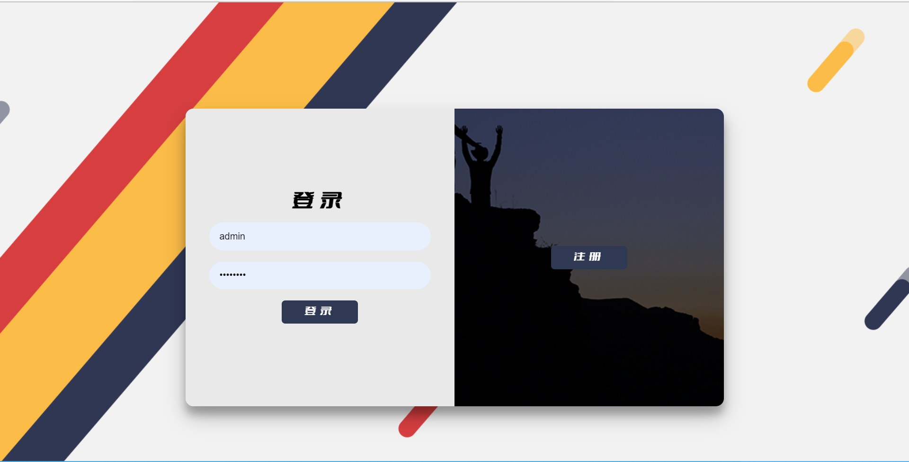
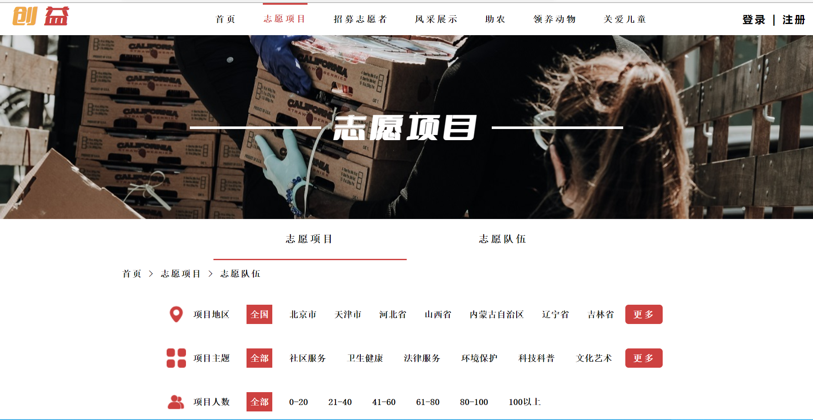
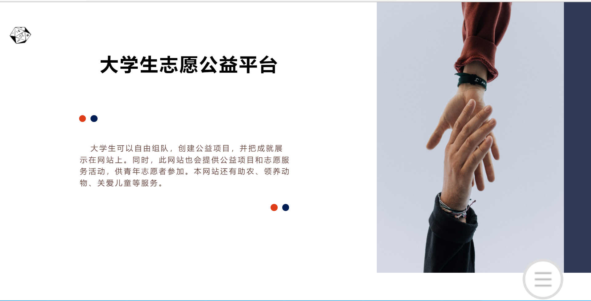
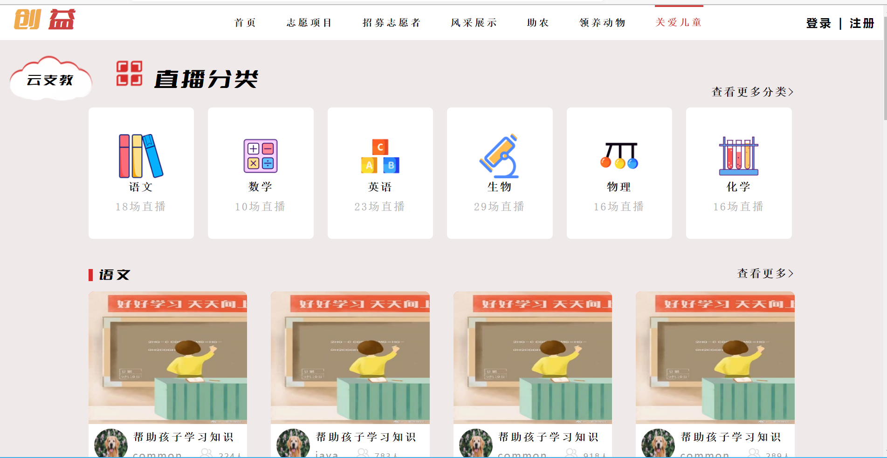
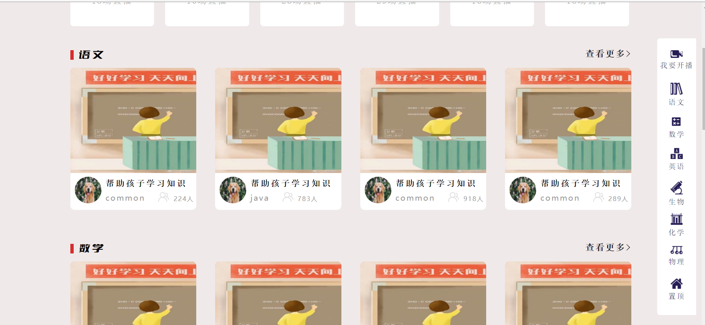

# commonweal

第十届软件设计大赛

<!-- TOC -->
* [commonweal](#commonweal)
  * [部分效果展示](#)
  * [**直播的实现**](#)
  * [涉及技术WebRTC、WebSocket](#webrtcwebsocket)
        * [简介：](#)
    * [**具体实现细节和思路：**](#)
  * [**前端:**](#)
    * [一、hash路由](#hash)
    * [二、websocket](#websocket)
    * [三、分页组件的封装](#)
    * [四、图片的懒加载](#)
    * [五、富文本编辑器](#)
    * [六、子页的搜索功能](#)
    * [七、节流](#)
    * [八、防抖](#)
    * [九、用form表单上传图片](#form)
    * [十、事件委托](#)
    * [十一、阻止事件冒泡等其他技术](#)
    * [十二、CSS3实现动画](#css3)
  * [**后端：**](#)
      * [**项目所使用的 jar 包**](#-jar-)
    * [**项目代码设计说明**](#)
      * [**dao 层：**](#dao-)
          * [**使用的自定义注解**](#)
          * [**处理程序**](#)
          * [**实现细节**](#)
      * [**Service 层：**](#service-)
      * [**web 层：**](#web-)
        * [使用的自定义注解：](#)
        * [实现思路：](#)
      * [**utils 包：**](#utils-)
      * [**pojo 包：**](#pojo-)
      * [**factory 包：**](#factory-)
<!-- TOC -->

## 部分效果展示

##  **直播的实现**
## 涉及技术WebRTC、WebSocket 
##### 简介：
1. **WebRTC是HTML5规范，可以帮助建立一个互联网浏览器之间的音视频和数据实时通信的平台，WebRTC在无需安装任何插件和第三方的软件，创建点对点的连接**
> - **使用到的api:**
> - **RTCPeerConnection、RTCSessionDescription、RTCIceCandidate等**

2. **WebSocket 是HTML5提供的一种浏览器与服务器进行全双工通讯的网络技术，这里它作为交换令牌信息的传递者**

### **具体实现细节和思路：**
**问题:**
> **实现一对多直播功能。**

**使用的解决方案：**
> 音视频数据流只在终端用户之间相互传输，，不经过任何的服务器节点,直接使用成熟的WebRTC传输方案，即发起者创建多个p2p的数据流到每一个接收端

**建立连接主要流程：**
>1. 发起者和对端应答者都连接同一个信令服务器(WebSocket)
>2. 发起端调用getUserMedia获取本地音视频
>3. 为连接的两端创建一个 RTCPeerConnection 对象，发起者给RTCPeerConnection 对象添加本地流（发起者通过用户id区分不同的RTCPeerConnection连接），获取本地媒体会话描述对象(Offer SDP)，并通过WebSocket发送给对端。
>4. 对端接收到后会设置远端描述信息，并创建应答会话描述对象（Answer SDP）信息通过WebSocket发送给发起端,发起端设置应答远端会话描述对象。
>5.  发起者获取网络信息(Candidate，IP 地址和端口)ICE发送给接受者(对端)。
>6.  对端收到ICE候选者给RTCPeerConnection添加远端的ICE候选者
>7.  接收端监听track事件得到视频流并添加播放
>8. 至此接受者就可以播放发送端的视频了

**优点：**
> 1. 逻辑简单，容易实现
> 2. 延迟最低
> 3. 每个接收端都会根据实际情况产生不同的比特率

**缺陷:**
> 1. 增加了上行网络带宽
> 2. 消耗客户端的资源
> 3. 无法让非WebRTC客户端接入

**其他解决方案：**

**1. 路由方式: SFU服务器（时间原因没有更多深入）**
> SFU 服务器与每一个 WebRTC 客户端建立连接，通过SFU服务器路由和转发WebRTC 客户端音视频数据流，在一对多中就是把一个客户端的流转发到其他 WebRTC客户端。主要 是数据包检测和转发，不做编码处理。这种方案适合大并发直播

## **前端:**

### 一、hash路由

后台管理员界面使用了前端hash路由，减缓了短时间内浏览器的请求压力

### 二、websocket

云支教开设了直播功能，直播功能还附带聊天室等多种功能，聊天室运用了websocket技术，同时项目中其他地方的私聊系统都是运用了websocket

### 三、分页组件的封装

利用面向对象的思想封装了分页组件，在志愿项目，助农等子页板块中使用

### 四、图片的懒加载

风采展示板块使用了图片的懒加载技术

### 五、富文本编辑器

在关爱儿童的云墙子板块，使用了富文本编辑器，提高用户体验

### 六、子页的搜索功能

在志愿项目等子页中，设置了条件搜索，如地区，主题等，同时也可以通过搜索项目名称等方式进行搜索

### 七、节流

项目中有多处地方使用了节流技术，如首页的翻页效果，表单的点击提交等，减少函数短时间内的多次触发

### 八、防抖

如input的onchange事件，可以使用防抖，通过setTimeout的方式，在一定时间间隔内，将多次触发变成一次触发

### 九、用form表单上传图片

在成就发布，项目头像编辑时，使用了图片上传技术

### 十、事件委托

页面渲染后，通过事件委托的方式，把原来需要绑定在子元素的响应事件委托给父元素，让父元素担当事件监听的职务

### 十一、阻止事件冒泡等其他技术

### 十二、CSS3实现动画

首页的翻页效果，首页的浮动动画、侧边栏悬浮球、轮播图、云墙的动画效果等

## **后端：**

#### **项目所使用的 jar 包**

1. JDK-16 -- java 开发工具
2. Tomcat,mysql,gson
3. druid --数据库连接池 （好处:类似线程池重复利用数据库连接）
4. log4j --日志

### **项目代码设计说明**

#### **dao 层：**

该层下的 core 包,主要实现了基本 CRUD 语句的拼接

###### **使用的自定义注解**

> - @TableField 用于声明数据库表中的字段名的注释。
> - @TableId 用于声明数据库表中的主键
> - @TableName 用于声明数据库表的表名

###### **处理程序**

BaseDao 抽象类封装了 dao 层的重复基本操作（**预编译语句和填充占位符等**）MyGenericBaseDao 抽象类继承 BaseDao,实现了拼接常用 CRUD 语句

###### **实现细节**

> - 主要通过工具类**ReflectUtils 和 SqlUtils**来获取注解信息和实体类字段信息
> - MyGenericBaseDao 会对实体类是否有**TableName**注解声明进行判断，没有默认表名是**类名小写**。对于表中的字段名，如果没有声明**TableField**的字段默认成员变量名的小写且根据**小驼峰变量名**的特点变成**带有下滑线**的形式，比如：gmtModified 对应 gmt_modified。
> - 主要实现的功能：
>
> 1.  插入语句根据提供的实体类的属性值不为空的且注解 TableField 的 insert 值不为 false 的成员变量进行插入
> 2.  查询语句主要是对提供的实体类属性值不为空的作为查询条件，实现了查询单个对象，多个对象，查询总记录数，为了处理一些复杂的查询条件还留下了一个根据提供的查询条件模板进行查询
> 3.  更新语句主要是以主键作为条件，其他值不为空且注解 TableField 的 update 不为 false 的作为更新的字段进行更新
> 4.  删除根据主键或则提供的实体类不为空的属性作为条件

#### **Service 层：**

> 主要就是通过 java 的动态代理进行事务控制，对每个 service 都创建
> 一个代理对象，实现 InvocationHandle 对 service 层处理的事务进行
> 开启,关闭以及回滚。

#### **web 层：**

该层主要是通过 HandOutServlet 分发请求，调用对应的 contoller 层的处理方法

##### 使用的自定义注解：

> - @MyRequestPath 用于声明请求路径
> - @AccessLevel 用于声明接口访问等级

##### 实现思路：

> - **HandOutServlet** 默认启动服务器时加载，拦截所有请求的 servlet 程序，初始化时先扫描 controller 包下的类；
> - **HandlerMapping** 处理扫描到的带有 **@MyRequestPath** 注解且有 value 或则 urlPattern 的类或则类下的成员方法，获取 urlPattern 的值和使用 HandleInfo 保存处理的对象实例，请求方法类型（GET，POST，PUT，DELETE）和对应的成员方法并保存到 map 中
> - 在拦截到请求时调用 **doDispatch** 方法处理请求，根据请求的地址，获取保存在 map 中的对应的方法，如果没有该地址则返回资源不存在的信息，如果方法不允许则返回请求方法不允许的信息，如果该请求请求等级越级则拒绝访问,如果都符合则调用该方法，方法参数为**HttpInfoWrapper**，将方法返回值响应回去，目前实现了根据返回类型分为两种响应格式 json 格式的响应和以流的形式响应
> - 对于动态路径参数只支持在地址结尾获取动态路径参数
> - **HttpInfoWrapper** 类封装了 **HttpServletResponse** 和 **HttpServletRequest** 的常用方法，比如：
>
> 1. 设置和获取多个 cookie
> 2. 设置，获取和移除 sessionAttribute
> 3. 获取 part
> 4. 获取 json 信息
> 5. 判断用户是否登录
> 6. 根据提供的类型获取路径参数的值，如果有的话
> 7. 获取请求参数

#### **utils 包：**

包含项目所需的工具类，比如：JDBCUtils，JDBC 工具类,该类可以获取和释放连接，开启，提交和关闭事务。

#### **pojo 包：**

1. po 持久对象 和 dto 数据传输对象的转化

   > DTO 是经过处理后的 PO，可能增加或者减少 PO 的属性,通过
   > ConversionUtils 相互转化 PO 和 DTO

#### **factory 包：**

包下主要是工厂类:

1. DaoFactory 负责创建 Dao 对象的工厂
   > 优点：
   >
   > 1. 可以集中管理 Dao 对象,更换方便
2. ProxyFactory 负责创建代理对象的工厂
   > 优点：
   >
   > 1. 可以简化代理对象生成的一些步骤
3. ServiceFactory 负责创建 Service 层对象的工厂
   > 优点：
   >
   > 1. 集中管理 Service 对象，更换方便
